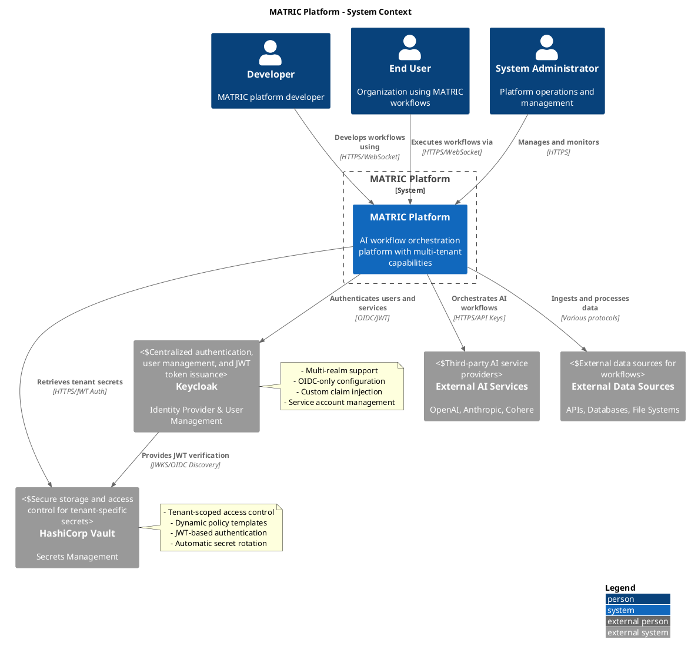
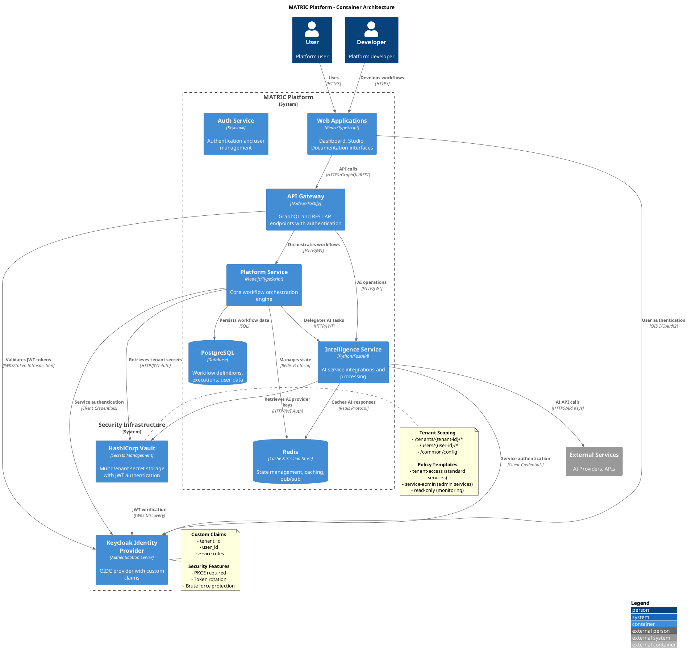
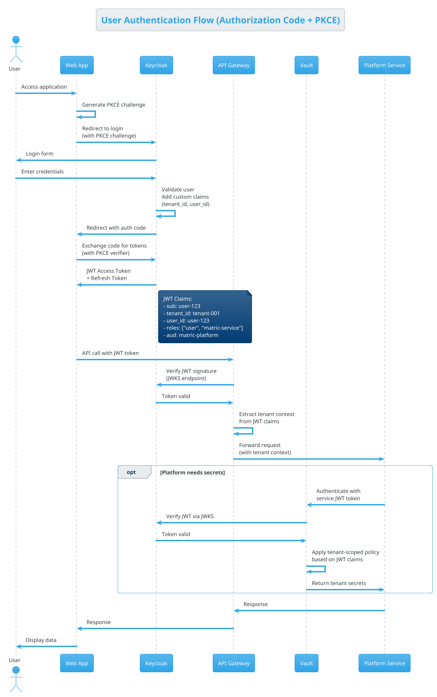
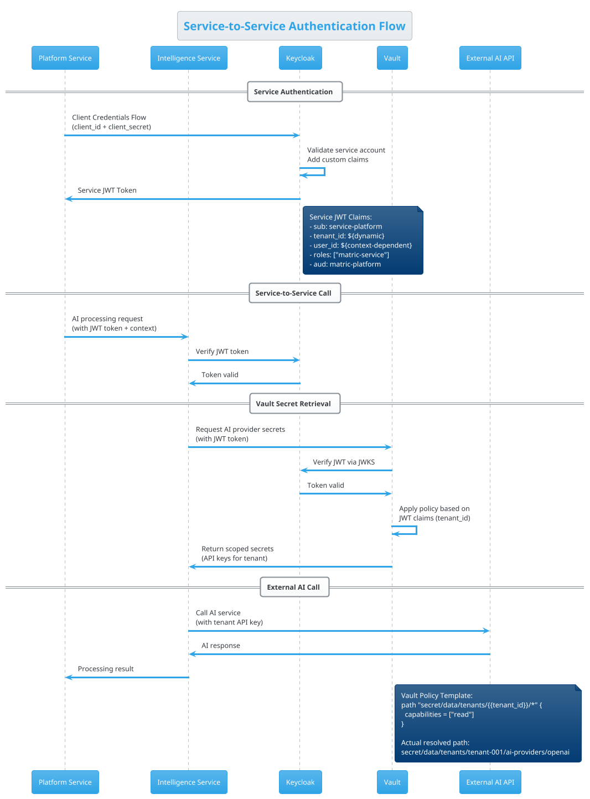
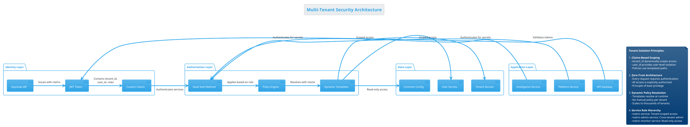
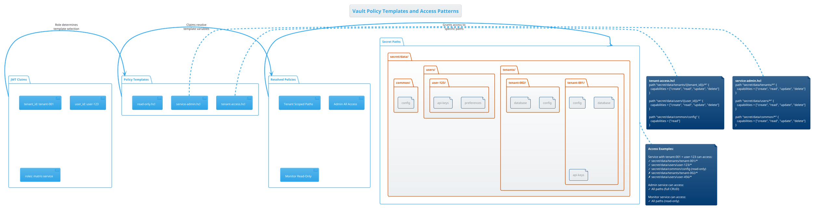

# MATRIC System Architecture - Authentication & Authorization

## Executive Summary

The MATRIC platform implements a sophisticated authentication and authorization architecture using Keycloak as the Identity Provider (IdP) and HashiCorp Vault for secrets management. This integration provides secure, scalable, multi-tenant authentication with JWT-based service-to-service communication and dynamic tenant-scoped access to secrets.

## System Context (C4 Level 1)



## Container Architecture (C4 Level 2)



## Authentication Sequence Diagrams

### User Authentication Flow



### Service-to-Service Authentication Flow



## Security Architecture

### Multi-Tenant Access Control



### Vault Policy Templates and Access Patterns



## Service Integration Patterns

### Platform Service Integration

```typescript
// Platform Service - Vault Integration Pattern
import { VaultClient } from '@matric/vault-client';

class MatricPlatformService {
  private vaultClient: VaultClient;
  
  constructor() {
    this.vaultClient = new VaultClient({
      vaultUrl: process.env.VAULT_URL,
      authMethod: 'jwt',
      role: 'matric-service'
    });
  }

  async executeWorkflow(workflowId: string, tenantContext: TenantContext) {
    // 1. Authenticate with Keycloak using service credentials
    const serviceToken = await this.getServiceToken(tenantContext);
    
    // 2. Use JWT to authenticate with Vault
    await this.vaultClient.authenticate(serviceToken);
    
    // 3. Retrieve tenant-specific configuration
    const tenantConfig = await this.vaultClient.getSecret(
      `tenants/${tenantContext.tenantId}/config`
    );
    
    // 4. Execute workflow with tenant context
    return this.processWorkflow(workflowId, tenantConfig, tenantContext);
  }

  private async getServiceToken(context: TenantContext): Promise<string> {
    const tokenRequest = {
      grant_type: 'client_credentials',
      client_id: 'matric-platform',
      client_secret: process.env.KEYCLOAK_CLIENT_SECRET,
      // Custom parameter injection for tenant context
      tenant_id: context.tenantId,
      user_id: context.userId
    };
    
    // Token will include tenant_id and user_id claims
    return this.keycloakClient.requestToken(tokenRequest);
  }
}
```

### Intelligence Service Integration

```python
# Intelligence Service - Vault Integration Pattern
from secrets_manager import VaultSecretsManager
from secrets_manager.models import OpenAISecrets, AnthropicSecrets

class MatricIntelligenceService:
    def __init__(self):
        self.vault_manager = VaultSecretsManager()
        
    async def process_ai_request(self, request: AIRequest, tenant_context: TenantContext):
        # 1. Initialize Vault connection with tenant context
        await self.vault_manager.initialize(tenant_context)
        
        # 2. Retrieve AI provider secrets for the tenant
        if request.provider == "openai":
            secrets = await self.vault_manager.get_secret(
                f"tenants/{tenant_context.tenant_id}/ai-providers/openai",
                OpenAISecrets
            )
            client = OpenAI(api_key=secrets.api_key.get_secret_value())
            
        elif request.provider == "anthropic":
            secrets = await self.vault_manager.get_secret(
                f"tenants/{tenant_context.tenant_id}/ai-providers/anthropic", 
                AnthropicSecrets
            )
            client = Anthropic(api_key=secrets.api_key.get_secret_value())
        
        # 3. Process request with tenant-specific configuration
        return await self.process_with_provider(client, request, secrets.config)
    
    async def initialize(self):
        """FastAPI lifespan integration"""
        await self.vault_manager.initialize()
        health = await self.vault_manager.health_check()
        if not health['vault_available']:
            logger.warning("Vault unavailable, falling back to environment variables")
```

## Deployment Architecture

### Development Environment

```plantuml
@startuml Development Deployment
!theme cerulean

title Development Environment - Docker Compose

node "Developer Machine" {
  component "Docker Compose" as compose
  
  container "matric-web" as web {
    port "3000" as webport
  }
  
  container "matric-platform" as platform {
    port "4000" as platformport
  }
  
  container "matric-intelligence" as intel {
    port "5000" as intelport
  }
  
  container "keycloak" as kc {
    port "8081" as kcport
  }
  
  container "vault" as vault {
    port "8200" as vaultport
  }
  
  container "vault-init" as vinit
  
  database "PostgreSQL" as pg {
    port "5432" as pgport
  }
  
  database "Redis" as redis {
    port "6379" as redisport
  }
}

web -> platform: API calls
platform -> intel: AI processing
web -> kc: User authentication
platform -> kc: Service authentication
intel -> kc: Service authentication
platform -> vault: Tenant secrets
intel -> vault: AI provider secrets
vault -> kc: JWT verification
vinit -> vault: Auto-configuration
platform -> pg: Workflow data
intel -> redis: Cache AI responses

note right of vault
  **Development Configuration:**
  - Root token: matric-dev-root-token
  - TLS disabled
  - File storage backend
  - Auto-initialization via vault-init
end note

note right of kc
  **Development Configuration:**
  - Realm: matric-dev
  - Test users pre-created
  - Permissive CORS settings
  - Custom claim mappers enabled
end note

@enduml
```

### Production Environment

```plantuml
@startuml Production Deployment
!theme cerulean

title Production Environment - Kubernetes

cloud "Load Balancer" as lb

node "Kubernetes Cluster" {
  package "Ingress Layer" {
    component "NGINX Ingress" as ingress
    component "Cert Manager" as certs
  }
  
  package "Application Layer" {
    component "Web Apps" as web [
      matric-web
      matric-docs
      matric-studio
    ]
    component "API Services" as api [
      matric-platform
      matric-intelligence
    ]
  }
  
  package "Authentication Layer" {
    component "Keycloak Cluster" as kc
    component "Keycloak Operator" as kcop
  }
  
  package "Security Layer" {
    component "Vault Cluster" as vault
    component "Vault Agent" as vagent
  }
  
  package "Data Layer" {
    database "PostgreSQL HA" as pg
    database "Redis Cluster" as redis
  }
  
  package "Monitoring" {
    component "Prometheus" as prom
    component "Grafana" as grafana
    component "Jaeger" as jaeger
  }
}

cloud "External Services" {
  component "OpenAI API" as openai
  component "Anthropic API" as anthropic
  component "AWS Services" as aws
}

lb -> ingress
ingress -> web
ingress -> api
web -> api: Internal service mesh
api -> kc: Authentication
api -> vault: Secrets
vault -> kc: JWT verification
api -> pg: Data persistence
api -> redis: Caching/state
api -> openai: AI processing
api -> anthropic: AI processing

prom -> api: Metrics collection
prom -> vault: Vault metrics
prom -> kc: Keycloak metrics
grafana -> prom: Visualization
jaeger -> api: Distributed tracing

note right of vault
  **Production Configuration:**
  - HA cluster (3+ nodes)
  - External storage (AWS/Azure)
  - TLS encryption
  - Auto-unsealing
  - Backup/restore
  - Audit logging
end note

note right of kc
  **Production Configuration:**
  - HA deployment
  - External database
  - TLS encryption
  - Rate limiting
  - Audit logging
  - Backup/restore
end note

@enduml
```

## Architecture Decision Records (ADRs)

### ADR-001: JWT-Based Service Authentication

**Status**: Accepted
**Date**: 2024-08-18

**Context**: 
MATRIC requires secure service-to-service authentication that scales across multiple tenants while maintaining isolation. Traditional API key management becomes complex with hundreds of tenants.

**Decision**: 
Implement JWT-based authentication using Keycloak as the token issuer and Vault for JWT verification with dynamic tenant scoping.

**Consequences**:
- **Positive**: Scalable, stateless authentication; Dynamic tenant scoping; Industry standard protocols
- **Negative**: Additional complexity in token management; Dependency on external services
- **Risks**: Token leakage requires immediate revocation; Clock synchronization requirements

### ADR-002: Vault Policy Templates for Multi-Tenancy

**Status**: Accepted
**Date**: 2024-08-18

**Context**:
Managing individual Vault policies for hundreds of tenants is operationally complex and error-prone. Need dynamic access control that scales automatically.

**Decision**:
Use Vault policy templates with JWT claim interpolation to provide dynamic tenant-scoped access without manual policy management.

**Consequences**:
- **Positive**: Automatic scaling to new tenants; Consistent access patterns; Reduced operational overhead
- **Negative**: Complex policy debugging; Limited to supported template variables
- **Risks**: Template syntax errors affect all tenants; Claim injection vulnerabilities

### ADR-003: Three-Tier Service Role Model

**Status**: Accepted  
**Date**: 2024-08-18

**Context**:
Different services require different levels of access to secrets. Some need tenant-scoped access, others need administrative privileges, and monitoring services need read-only access.

**Decision**:
Implement three service roles: `matric-service` (tenant-scoped), `matric-admin-service` (cross-tenant admin), and `matric-monitor-service` (read-only).

**Consequences**:
- **Positive**: Clear separation of concerns; Principle of least privilege; Simplified permission management
- **Negative**: Complexity in role assignment; Potential for privilege escalation
- **Risks**: Misconfigured roles could lead to unauthorized access

## Integration Guidance for Developers

### Implementing Authentication in New Services

1. **Service Registration**:
   ```bash
   # Create service account in Keycloak
   ./scripts/create-client.sh your-service-name
   
   # Assign appropriate role
   # Standard service: matric-service
   # Admin service: matric-admin-service  
   # Monitor service: matric-monitor-service
   ```

2. **Environment Configuration**:
   ```bash
   # Required environment variables
   KEYCLOAK_URL=http://localhost:8081
   KEYCLOAK_REALM=matric-dev
   KEYCLOAK_CLIENT_ID=your-service-name
   KEYCLOAK_CLIENT_SECRET=your-service-secret
   VAULT_URL=http://localhost:8200
   ```

3. **Authentication Implementation**:
   ```typescript
   // TypeScript/Node.js example
   import { MatricAuthClient } from '@matric/auth-client';
   
   const authClient = new MatricAuthClient({
     keycloakUrl: process.env.KEYCLOAK_URL,
     realm: process.env.KEYCLOAK_REALM,
     clientId: process.env.KEYCLOAK_CLIENT_ID,
     clientSecret: process.env.KEYCLOAK_CLIENT_SECRET,
     vaultUrl: process.env.VAULT_URL
   });
   
   // Get authenticated Vault client
   const vaultClient = await authClient.getVaultClient();
   
   // Retrieve tenant secrets
   const secrets = await vaultClient.getSecret(
     `tenants/${tenantId}/config`
   );
   ```

4. **Python Example**:
   ```python
   # Python/FastAPI example
   from matric_auth import MatricAuthClient, TenantContext
   
   auth_client = MatricAuthClient(
       keycloak_url=os.getenv("KEYCLOAK_URL"),
       realm=os.getenv("KEYCLOAK_REALM"),
       client_id=os.getenv("KEYCLOAK_CLIENT_ID"),
       client_secret=os.getenv("KEYCLOAK_CLIENT_SECRET"),
       vault_url=os.getenv("VAULT_URL")
   )
   
   @app.get("/api/workflow/{workflow_id}")
   async def get_workflow(
       workflow_id: str,
       tenant_context: TenantContext = Depends(get_tenant_context)
   ):
       vault_client = await auth_client.get_vault_client(tenant_context)
       config = await vault_client.get_secret(f"tenants/{tenant_context.tenant_id}/config")
       return process_workflow(workflow_id, config)
   ```

### Secret Organization Best Practices

1. **Path Structure**:
   ```
   secret/
   ├── tenants/
   │   └── {tenant-id}/
   │       ├── config              # Tenant configuration
   │       ├── database            # Database credentials  
   │       ├── ai-providers/       # AI service API keys
   │       │   ├── openai
   │       │   ├── anthropic
   │       │   └── cohere
   │       ├── integrations/       # Third-party integrations
   │       └── certificates/       # SSL certificates
   ├── users/
   │   └── {user-id}/
   │       ├── preferences         # User preferences
   │       ├── api-keys           # Personal API keys
   │       └── tokens             # OAuth tokens
   └── common/
       ├── config                 # Global configuration
       ├── service-accounts       # Service credentials
       └── certificates           # Shared certificates
   ```

2. **Secret Naming Conventions**:
   - Use kebab-case for secret names
   - Include environment prefix for multi-env deployments
   - Version secrets when rotating (e.g., `api-key-v2`)
   - Use descriptive names that indicate purpose

3. **Secret Rotation Strategy**:
   - Implement automated rotation for high-value secrets
   - Use versioned secrets for zero-downtime rotation
   - Monitor secret age and usage
   - Test rotation procedures regularly

## Monitoring and Observability

### Key Metrics

1. **Authentication Metrics**:
   - Token validation success/failure rates
   - Authentication latency (p50, p95, p99)
   - Token refresh frequency
   - Failed authentication attempts

2. **Vault Metrics**:
   - Secret retrieval latency
   - Cache hit/miss ratios
   - Vault token TTL and renewal
   - Policy evaluation performance

3. **Security Metrics**:
   - Cross-tenant access attempts
   - Privilege escalation attempts
   - Unusual secret access patterns
   - Token lifetime violations

### Alerting Rules

```yaml
groups:
- name: matric-auth
  rules:
  - alert: HighAuthFailureRate
    expr: rate(keycloak_login_failures_total[5m]) > 0.1
    for: 2m
    labels:
      severity: warning
    annotations:
      summary: High authentication failure rate detected

  - alert: VaultTokenNearExpiry
    expr: vault_token_ttl_seconds < 300
    for: 1m
    labels:
      severity: critical
    annotations:
      summary: Vault token expiring in less than 5 minutes

  - alert: CrossTenantAccessAttempt
    expr: increase(vault_access_denied_total{reason="policy"}[1m]) > 0
    for: 0m
    labels:
      severity: critical
    annotations:
      summary: Unauthorized cross-tenant access attempted
```

## Disaster Recovery and Business Continuity

### Recovery Time Objectives (RTO) and Recovery Point Objectives (RPO)

| Component | RTO Target | RPO Target | Recovery Strategy |
|-----------|------------|------------|-------------------|
| Keycloak | < 30 minutes | < 5 minutes | HA cluster + backup restoration |
| Vault | < 15 minutes | < 1 minute | HA cluster + continuous replication |
| User Authentication | < 5 minutes | N/A | Load balancer failover |
| Service Authentication | < 2 minutes | N/A | Auto-retry with backoff |

### Failover Procedures

1. **Keycloak Failover**:
   - Automatic failover via load balancer health checks
   - Database replica promotion if primary fails
   - Manual intervention for complete cluster failure

2. **Vault Failover**:
   - Automatic leader election in HA cluster
   - Unsealing procedures for complete cluster failure
   - Backup restoration from encrypted snapshots

3. **Authentication Degradation**:
   - Graceful degradation to cached tokens
   - Emergency bypass procedures for critical services
   - Fallback to emergency credentials for disaster scenarios

## Security Considerations

### Threat Model

1. **External Threats**:
   - Credential stuffing attacks on user accounts
   - JWT token interception and replay
   - API key compromise and misuse
   - DDoS attacks on authentication services

2. **Internal Threats**:
   - Privileged user compromise
   - Service account key rotation failures
   - Cross-tenant data access attempts
   - Vault unsealing key compromise

3. **Mitigation Strategies**:
   - Multi-factor authentication for privileged accounts
   - Short-lived tokens with automatic renewal
   - Network segmentation and zero-trust networking
   - Comprehensive audit logging and monitoring
   - Regular security assessments and penetration testing

### Compliance Framework

The MATRIC authentication architecture supports compliance with:

- **SOC 2 Type II**: Comprehensive audit logging, access controls, and security monitoring
- **GDPR**: Data minimization, right to deletion, privacy by design
- **ISO 27001**: Information security management system
- **PCI DSS**: Secure handling of sensitive authentication data

## Future Enhancements

### Planned Improvements

1. **Enhanced Multi-Tenancy**:
   - Hierarchical tenant structures
   - Tenant-specific identity providers
   - Custom authentication flows per tenant
   - Tenant isolation verification tools

2. **Advanced Security Features**:
   - Zero-knowledge secret sharing
   - Hardware security module (HSM) integration
   - Behavioral authentication analytics
   - Automated threat response

3. **Operational Improvements**:
   - Self-service tenant onboarding
   - Automated secret rotation
   - Performance optimization
   - Cost optimization strategies

### Migration Roadmap

1. **Phase 1** (Current): Basic JWT + Vault integration
2. **Phase 2** (Q1 2025): Enhanced monitoring and alerting
3. **Phase 3** (Q2 2025): Advanced security features
4. **Phase 4** (Q3 2025): Multi-region deployment
5. **Phase 5** (Q4 2025): Self-service capabilities

---

**Document Version**: 1.0  
**Last Updated**: August 18, 2024  
**Next Review**: September 18, 2024  
**Stakeholders**: Platform Engineering, Security Team, Development Teams